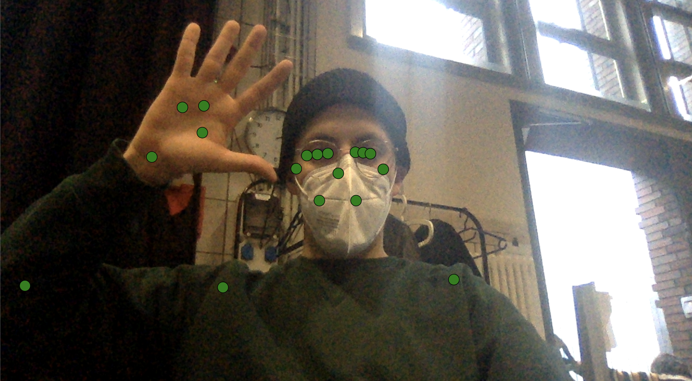

# Blazepose and p5.js

This is a small project to use the skeleton data from blazepose with p5.js. This will analyse a live video from your webcam.



## Getting Started

### Usage

1. Download or clone the repository. 
2. You can just drag and drop the index.html, file in the »src« folder, on to your browser. You can also start a small http server. ([http-server](https://www.npmjs.com/package/http-server)) 

It may take some time to start.

### Code

You can start changing the visualisation in the src/sketch.js file.

```javascript
const canvasWidth = 1280
const canvasHeight = 720
let capture

// This is the Setup. It will be executed once in the beginning.
function setup () {
  createCanvas(canvasWidth, canvasHeight)
  capture = createCapture(VIDEO)
  capture.size(canvasWidth, canvasHeight)
}

// This is the draw function which will be excuted permanentely
function draw () {
  // Drawing the video image  
  image(capture, 0, 0, canvasWidth, canvasHeight);
  fill('green')
  
  // Here are the landmarks which will be tracked by blazepose
  if (landmarks && landmarks.length) {
    for (let i = 0; i < landmarks.length; i++) {
      console.log(landmarks[i])
      // These are the x and y coordinated of the landmarks  
      const x = canvasWidth * landmarks[i].x
      const y = canvasHeight * landmarks[i].y
       
      // Here you can use the positions of the landmarks to display anything. 
      // Currenty there is only one ellipse on every coordinate
      ellipse(x, y, 20)
    }
  }
}
```

### An overview of the coordinates from blazepose


## Resources

### p5.js

1. [p5.js](https://p5js.org/)
2. [Coding Train](https://www.youtube.com/channel/UCvjgXvBlbQiydffZU7m1_aw)

### Blazepose

1. [Blazepose by Google](https://google.github.io/mediapipe/solutions/pose.html)
